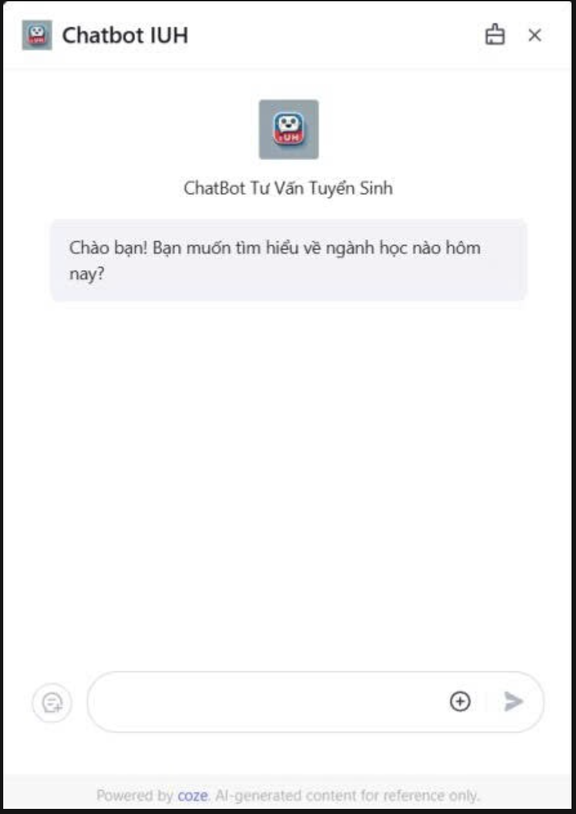

# Xây Dựng Chatbot Tư Vấn Tuyển Sinh

## Thông Tin Nhóm
- **Phan Lâm Hùng** - MSSV: 22661791
- **Nguyễn Đình Trung Nam** - MSSV: 22632561
- **Phạm Hoàng Phát** - MSSV: 22703861
- **Lê Nguyễn Phúc Hưng** - MSSV: 22672481

## Hướng Dẫn Cài Đặt và Sử Dụng

### Yêu Cầu Hệ Thống
- Python 3.8 trở lên
- pip (Python package manager)

### Các Bước Cài Đặt

1. Clone repository về máy:
```bash
git clone [link-repository]
cd [ten-thu-muc]
```

2. Tạo và kích hoạt môi trường ảo:
```bash
python -m venv venv
source venv/bin/activate  # Trên Linux/Mac
# hoặc
venv\Scripts\activate  # Trên Windows
```

3. Cài đặt các thư viện cần thiết:
```bash
pip install -r requirements.txt
```

4. Khởi tạo cơ sở dữ liệu:
```bash
flask db init
flask db migrate
flask db upgrade
```

5. Chạy ứng dụng:
```bash
python app.py
```

### Hướng Dẫn Sử Dụng

1. Truy cập ứng dụng qua trình duyệt web tại địa chỉ: `http://iuh-chatbot.ddns.net`

2. Đăng ký tài khoản mới hoặc đăng nhập nếu đã có tài khoản

3. Các chức năng chính:
   - Xem thông tin tuyển sinh
   - Tìm hiểu về các ngành học
   - Đọc thông báo mới
   - Tương tác với chatbot tư vấn

4. Với tài khoản admin:
   - Quản lý bài viết (thêm sửa xoá)
   - Quản lý thông báo (thêm sửa xoá)
   - Quản lý thông tin tuyển sinh (thêm sửa xoá)
   - Quản lý ngành học(thêm sửa xoá)
   - Quản lý người dùng(block, reset password)

## Video Demo
[https://drive.google.com/drive/folders/1rLsv05FcsQo9Qz7yuQLOXfNymhfR4A_a]()

## Screenshots

### 1. Trang Chủ


### 2. Đăng Nhập


### 3. Đăng Ký


### 4. Thông Tin Tuyển Sinh


### 5. Danh Sách Ngành Học


### 6. Thông Báo


### 7. Trang Admin


### 8.Bài Viết


### 9. Chatbot Tư Vấn
